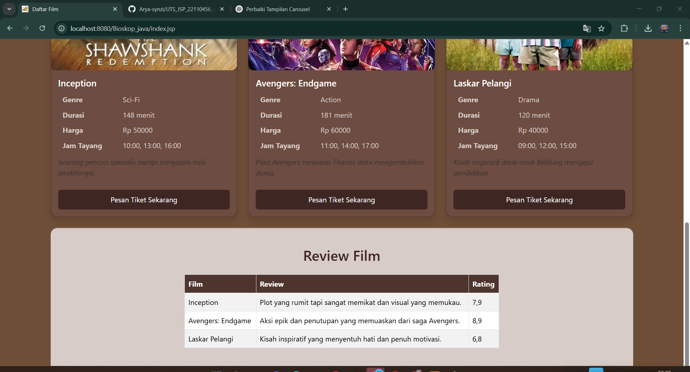
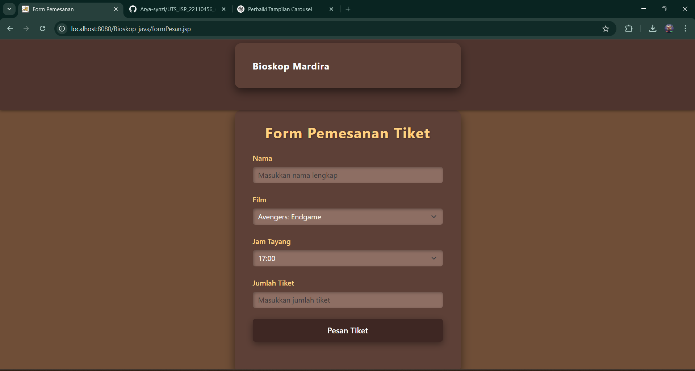
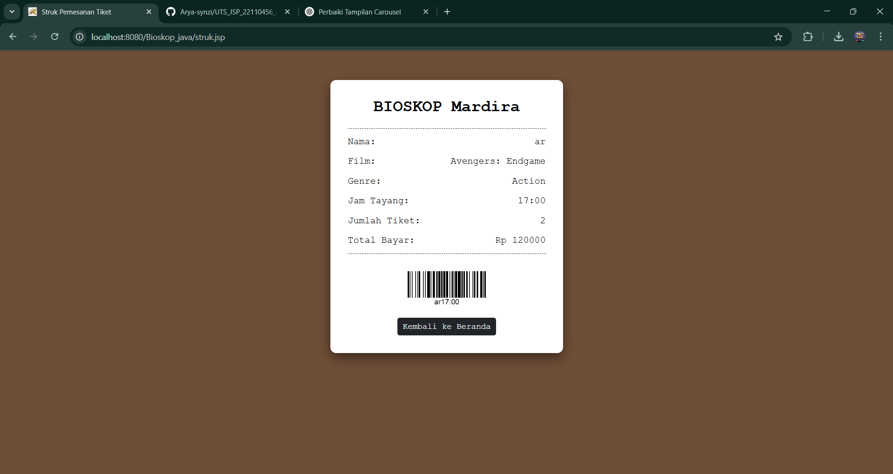

<h1 align="center">🎬 UTS JSP - Sistem Pemesanan Tiket Bioskop</h1>

<p align="center">
  <strong>Nama:ARYA DUTHA RAMADHAN</strong> John Doe &nbsp;|&nbsp;
  <strong>NIM:22110456</strong> 123456 &nbsp;|&nbsp;
  <strong>Kelas:L2022 </strong> PWJ-2A
</p>

---

## 🧾 Deskripsi Project

Aplikasi JSP ini memungkinkan pengguna untuk melakukan **pemesanan tiket bioskop** secara online,  
Fitur utama:

- 🎥 Memilih film dari daftar yang tersedia
- 🕒 Menentukan jam tayang berdasarkan pilihan film
- 🎟️ Mengisi jumlah tiket dan nama pemesan
- 🧾 Melihat struk transaksi akhir dalam tampilan **struk digital ** lengkap dengan **barcode**

---

## 🛠️ Teknologi yang Digunakan

- **Java JSP/Servlet**
- **ArrayList** untuk penyimpanan data film
- **Bootstrap 5.3** untuk tampilan UI responsif
- **HTML & CSS** custom styling
- **Barcode image** sebagai sentuhan profesional

---

## 📸 Tampilan Aplikasi


### 🎟️ Form Pemesanan Tiket


### 🧾 Struk Pemesanan (Gaya Digital)


---

## 🚀 Cara Menjalankan Aplikasi

1. **Clone repository**
```bash
git clone https://github.com/Arya-synzi/UTS_JSP_22110456_ARYA-DUTHA-RAMADHAN.git
